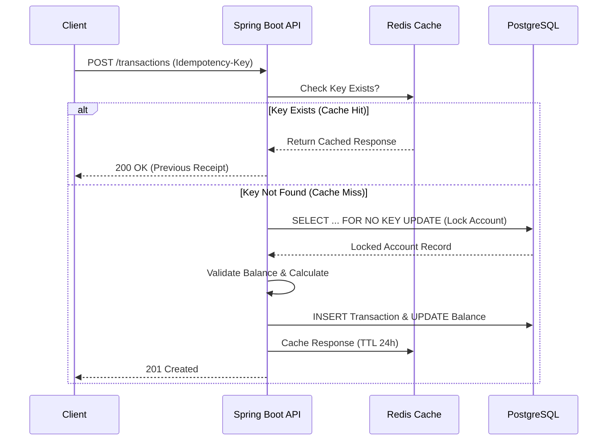

# 🛡️ Idempotent Payment Gateway

A high-performance, resilient payment gateway MVP designed to handle **concurrency** and **idempotency** challenges in distributed systems.

Built with **Java 17**, **Spring Boot 3**, **Redis**, and **PostgreSQL**.


## 📖 About The Project

In financial systems, two problems are critical:
1.  **Double Spending/Charging:** A network glitch shouldn't cause a user to be charged twice for the same click.
2.  **Race Conditions:** Multiple concurrent transactions shouldn't corrupt the account balance.

This project implements a robust solution using **Idempotency Keys** (cached in Redis) and **Pessimistic Locking** (Database level) to guarantee data integrity under stress.

## 🏗️ Architecture

The system follows a layered architecture with a focus on data consistency.



### Key Features

- **Idempotency:** Prevents duplicate processing of the same request using **Idempotency-Key headers** and **Redis**.
- **Concurrency Control:** Uses `PESSIMISTIC_WRITE` (Select for Update) locking to serialize concurrent balance updates.
- **Audit Trail:** Every balance change creates an immutable BankEntry and Transaction Header.
- **Performance:** Validated with **k6 load testing** (50+ concurrent users with sub-200ms latency).

## 🛠️ Tech Stack

- **Language:** Java 17
- **Framework:** Spring Boot (Web, Data JPA, Validation, Redis)
- **Database:** PostgreSQL
- **Cache:** Redis
- **Migrations:** Flyway
- **Testing:** k6, JUnit 5

## 🚀 Quick Start

### Prerequisites

- Java 17+
- Docker & Docker Compose
- Maven

### 1. Start Infrastructure (Postgres & Redis)

Run Redis and Postgres containers:

```
docker-compose up -d
```

### 2. Build & Run the Application (if not using an IDE)

Build the Spring Boot application:

```
mvn clean install
```
Run the application:

```
mvn spring-boot:run
```
## 📚 API Documentation (Swagger UI)

After running the application, you can access the interactive API documentation at:
👉 http://localhost:8080/swagger-ui.html

## 🔌 API Endpoints

### 1. Create Account
Initialize a new bank account with a starting balance.

* **URL:** `POST /accounts`
* **Body:**
    ```json
    {
      "name": "John Doe",
      "initialBalance": 1000.00
    }
    ```
* **Response:** Returns the created Account ID (UUID).

### 2. Process Transaction
Debits or Credits an account. **Requires Idempotency Key**.

* **URL:** `POST /transactions`
* **Header:** `Idempotency-Key: <unique-uuid>`
* **Body:**
    ```json
    {
      "accountId": "<your-account-id>",
      "amount": 50.00,
      "type": "DEBIT"
    }
    ```

### 3. Get Balance
Checks the current account balance.

* **URL:** `GET /accounts/{id}/balance`

## ⚡ Stress Testing

To validate the resilience of the locking mechanism, a load test script using **k6** is included.

**Scenario**: 50 concurrent users trying to debit 1.00 at the exact same millisecond.

1. **Update the Script**: Open `stress_test.js` and update the `account_id` variable with an existing account ID from your database.
2. **Run the test**:

```bash
k6 run stress_test.js
```